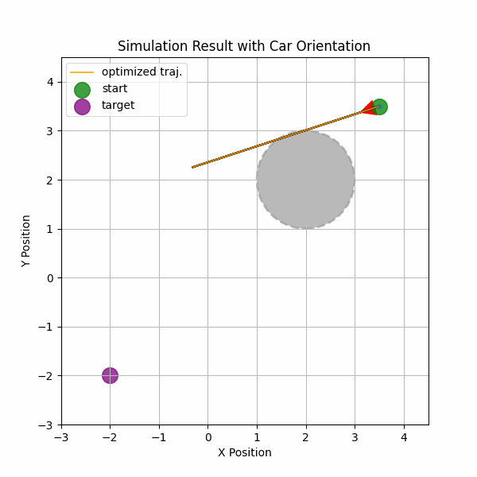

# mppi_cbf_playground
Colab notebooks of personal experiments with MPPI and CBF.

### Content

| Controller | Safety Filter               | Model       | Colab Link                                                                                                                                                                                     |
| ---------- | --------------------------- | ----------- | ---------------------------------------------------------------------------------------------------------------------------------------------------------------------------------------------- |
| MPPI       | CBF cost                    | Bicycle car |  |
|            | CBF-QP                      | Bicycle car |  |
|            | Nonlinear predictive filter | Bicycle car |  |

### Demo
The following animations are simulation result of MPPI controller for obstacle avoidance.
- Left: w/ CBF cost
- Middle: w/ CBFQP as safety filter
- Right: w/ nonlinnear predictive filter

    

### Note for implementations
- The terminal cost in MPPI is significant. It enhances the quality of the control sequence's prior, thereby preventing the controller from inadvertently deviating the system from its target position.
- The discrete CBF cost aligns well with sampling-based predictive controllers, introducing only minimal additional computation.
- The guarantees provided by CBF-QP diminish with discretization.

### References
1. Shield Model Predictive Path Integral: A Computationally Efficient Robust MPC Approach Using Control Barrier Functions, Ji Yin, et.al. https://arxiv.org/abs/2302.11719
