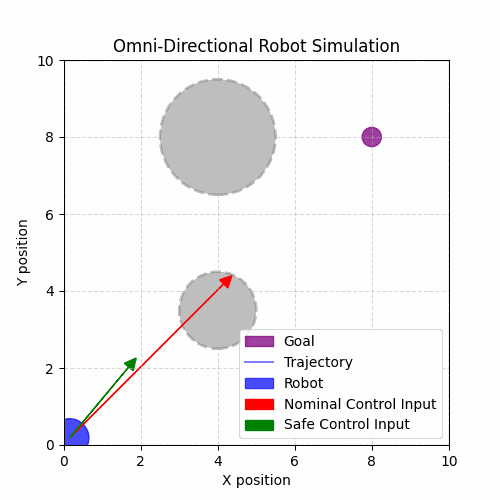

# mppi_cbf_playground
Colab notebooks of personal experiments with MPPI and CBF. Each notebook is stand-alone and can be executed immediately in Colab without extra setup.

## Content

| Nominal Controller | Safety Filter               | Model                                   | Colab Link                                                                                                                                                                                             |
| ------------------ | --------------------------- | --------------------------------------- | ------------------------------------------------------------------------------------------------------------------------------------------------------------------------------------------------------ |
| CLF-QP               | CBF-QP                    | Omnidirectioal Robot                             |          |
| MPPI               | CBF cost                    | Unicycle car                             |          |
|                    | CBF-QP                      | Unicycle car                             | Same as above                                                                                                                                                                                          |
|                    | Nonlinear predictive filter | Unicycle car                             | Same as above                                                                                                                                                                                          |
| MPPI               | CBF cost                    | Planar quadrotor                        |           |
| [Sequential QP](https://hybrid-robotics.berkeley.edu/publications/ACC2016_Safety_Control_Planar_Quadrotor.pdf)         | CLF-CBF-QP                    | Planar quadrotor |  |
| MPPI               | CBF cost                    | Planar quadrotor with a suspended payload |  |

## Demonstrations
### Demo 1: bicycle car
The following animations are simulation result of MPPI controller for obstacle avoidance.
- Left: w/ CBF as a cost term in MPPI.
- Middle: w/ a CBFQP safety filter.
- Right: w/ a nonlinear predictive safety filter.

    

### Demo 2: planar quadrotor with MPPI controller
The following animations are simulation result of MPPI controller with CBF cost for obstacle avoidance.
- Left: w/ CBF as a cost term in MPPI.
- Right: w/ CBF as a cost term in MPPI. A suspended payload is attached to the quadrotor.

   

### Demo 3: plannar quadrotor with CLF-CBF-QP controller
The following figures show a closed-loop simulation result of sequential CLF-QP controller w/ and w/o CBF as a constraint.

  

### Demo 4: Closed-form solution of CLF-CBF-QP controller
The following figures show a simulation result of CLF-QP controller w/ a safety filter using composite CBF.

  

### Note for implementations
- The terminal cost in MPPI is significant. It enhances the quality of the control sequence's prior, thereby preventing the controller from inadvertently deviating the system from its target position.
- The discrete CBF cost aligns well with sampling-based predictive controllers, introducing only minimal additional computation.
- The guarantees provided by CBF-QP diminish with discretization.

### References
1. Yin, Ji, et al. "Shield Model Predictive Path Integral: A Computationally Efficient Robust MPC Approach Using Control Barrier Functions." arXiv preprint arXiv:2302.11719 (2023). https://arxiv.org/abs/2302.11719
2. Ames, Aaron D., et al. "Control barrier functions: Theory and applications." 2019 18th European control conference (ECC). IEEE, 2019. https://arxiv.org/abs/1903.11199
3. Wu, Guofan, and Koushil Sreenath. "Safety-critical control of a planar quadrotor." 2016 American control conference (ACC). IEEE, 2016.
